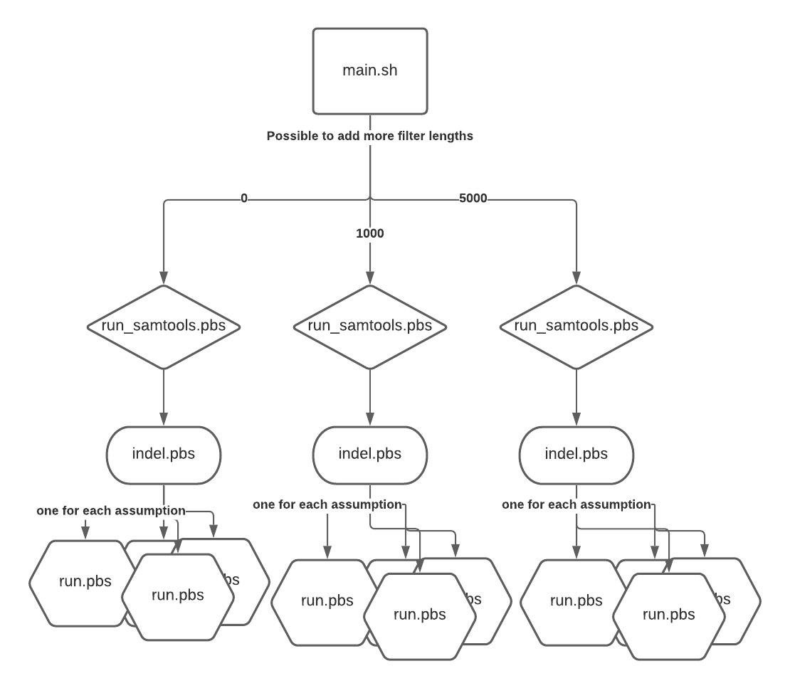

# USER DOCUMENTATION: Genome Size

Estimating genome size from long-read sequencing data. Re-engineering and extending [Richard Edward’s implementation](https://github.com/slimsuite/diploidocus). Read length filtering, insertion/deletion bias and soft clipping bias have been accounted for.
 
Pipeline launches multiple scripts to predict genome size from a BAM file of mapped long-read data and a BUSCO generated .tsv of single copy orthologs. The pipeline produces multiple size predictions, one each for each combination of assumptions. This pipeline automates the testing of each combination of assumptions to allow for an empirical method to calculate genome size. It considers technical influences from sequencing or read mapping that may distort a genome size prediction, leaving it to the researcher’s discretion and their knowledge of the biases of their data to make a final decision.
 
# Getting Started

### Quick Usage

Will run pipeline with the default generated `assumptions.txt` and two threads.
```
NAME=e_coli
OD=/srv/scratch/z3452659/BINF6112-Sep20/TeamGenomeSize/output/e_coli
BAM=/srv/scratch/z3452659/BINF6112-Sep20/TeamGenomeSize/data/2020-09-22.ReferenceGenomes/e_coli/bam/e_coli.bam
SCO=/srv/scratch/z3452659/BINF6112-Sep20/TeamGenomeSize/data/2020-09-22.ReferenceGenomes/e_coli/busco3/run_e_coli/full_table_e_coli.tsv
WD=/home/$USER/GenomeSize
THREADS=2
mkdir -p ${OD}; ./main.sh -od ${OD} -nm ${NAME} -wd ${WD} -b ${BAM} -sco ${SCO} -t ${THREADS}
```

### Running custom set of assumptions

1) Modify `assumptions.txt` with desired set of assumptions
2) Add -c flag to pipeline and otherwise run normally
```
NAME=e_coli
OD=/srv/scratch/z3452659/BINF6112-Sep20/TeamGenomeSize/output/e_coli
BAM=/srv/scratch/z3452659/BINF6112-Sep20/TeamGenomeSize/data/2020-09-22.ReferenceGenomes/e_coli/bam/e_coli.bam
SCO=/srv/scratch/z3452659/BINF6112-Sep20/TeamGenomeSize/data/2020-09-22.ReferenceGenomes/e_coli/busco3/run_e_coli/full_table_e_coli.tsv
WD=/home/$USER/GenomeSize
THREADS=2
mkdir -p ${OD}; ./main.sh -od ${OD} -nm ${NAME} -wd ${WD} -b ${BAM} -sco ${SCO} -t ${THREADS} -c
```

### Help Flag
```
Usage: ./main.sh [optional] -od <output_dir> -nn <species> -wd <working_dir> -b <in.bam> -sco <.tsv> [optional]
Mandatory:
-nm NAME      root name for files created by pipeline
-wd PATH      path to top level of code i.e. same level as this main.sh script
-od PATH      path to desired output directory (must already exist)
-sco FILE     path to tsv of BUSCO single copy ortholog output
-b FILE       path to bam file of mapped reads
Optional:
-t INT        number of threads to run samtools computations
-c            flag to specify custom generation of assumptions
```

# Pipeline Output
A comma-separated file containing the summary of all output generated by genomeSize.py, with headers showing which assumptions were used for each calculation. This is easily parseable by pandas and R.
 
## Example Output

- Raw output of ` d_melanogaster_genomeSize_log.csv`
```
PID,Filter,Method,Indel On,Indel Bias,Read Clipping On,Clipping Bias,Volume,Depth,Genome Size
859570,1000,modeDepth,false,1,true,0.91,31814520668.0,200,174805058.62
859563,1000,medDepth,false,1,false,1,31814520668.0,73,435815351.62
859561,1000,medDepth,true,1.0434,false,1,31814520668.0,73,417687705.21
859562,1000,medDepth,false,1,true,0.91,31814520668.0,73,478917968.81
859560,1000,medDepth,true,1.0434,true,0.91,31814520668.0,73,458997478.25
859569,1000,modeDepth,true,1.0434,false,1,31814520668.0,200,152456012.4
859568,1000,modeDepth,true,1.0434,true,0.91,31814520668.0,200,167534079.56
859571,1000,modeDepth,false,1,false,1,31814520668.0,200,159072603.34
859576,5000,medDepth,false,1,true,0.91,29014756524.0,61,522694226.7
859577,5000,medDepth,false,1,false,1,29014756524.0,61,475651746.3
859585,5000,modeDepth,false,1,false,1,29014756524.0,184,157688894.15
859582,5000,modeDepth,true,1.0414,true,0.91,29014756524.0,184,166395716.41
859575,5000,medDepth,true,1.0414,false,1,29014756524.0,61,456742602.55
859574,5000,medDepth,true,1.0414,true,0.91,29014756524.0,61,501914947.86
859584,5000,modeDepth,false,1,true,0.91,29014756524.0,184,173284499.07
859583,5000,modeDepth,true,1.0414,false,1,29014756524.0,184,151420101.93
859567,1000,mmDepth,false,1,false,1,31814520668.0,192,165700628.48
859566,1000,mmDepth,false,1,true,0.91,31814520668.0,192,182088602.72
859564,1000,mmDepth,true,1.0434,true,0.91,31814520668.0,192,174514666.21
859565,1000,mmDepth,true,1.0434,false,1,31814520668.0,192,158808346.25
859581,5000,mmDepth,false,1,false,1,29014756524.0,175,165798608.71
859580,5000,mmDepth,false,1,true,0.91,29014756524.0,175,182196273.31
859579,5000,mmDepth,true,1.0414,false,1,29014756524.0,175,159207421.46
859578,5000,mmDepth,true,1.0414,true,0.91,29014756524.0,175,174953210.4
859557,0,modeDepth,false,1,false,1,31932587080.0,202,158082114.26
859555,0,modeDepth,true,1.0438,false,1,31932587080.0,202,151448662.83
859554,0,modeDepth,true,1.0438,true,0.91,31932587080.0,202,166427102.01
859556,0,modeDepth,false,1,true,0.91,31932587080.0,202,173716609.07
859548,0,medDepth,false,1,false,1,31932587080.0,73,437432699.73
859545,0,medDepth,true,1.0438,true,0.91,31932587080.0,73,460524309.66
859546,0,medDepth,true,1.0438,false,1,31932587080.0,73,419077121.79
859547,0,medDepth,false,1,true,0.91,31932587080.0,73,480695274.42
859552,0,mmDepth,false,1,false,1,31932587080.0,202,158082114.26
859551,0,mmDepth,false,1,true,0.91,31932587080.0,202,173716609.07
859550,0,mmDepth,true,1.0438,false,1,31932587080.0,202,151448662.83
859549,0,mmDepth,true,1.0438,true,0.91,31932587080.0,202,166427102.01
```
 
- Sorted by genome size
```
$ cat d_melanogaster_genomeSize_log.csv | sort -t',' -k10
859583,5000,modeDepth,true,1.0414,false,1,29014756524.0,184,151420101.93
859550,0,mmDepth,true,1.0438,false,1,31932587080.0,202,151448662.83
859555,0,modeDepth,true,1.0438,false,1,31932587080.0,202,151448662.83
859569,1000,modeDepth,true,1.0434,false,1,31814520668.0,200,152456012.4
859585,5000,modeDepth,false,1,false,1,29014756524.0,184,157688894.15
859552,0,mmDepth,false,1,false,1,31932587080.0,202,158082114.26
859557,0,modeDepth,false,1,false,1,31932587080.0,202,158082114.26
859565,1000,mmDepth,true,1.0434,false,1,31814520668.0,192,158808346.25
859571,1000,modeDepth,false,1,false,1,31814520668.0,200,159072603.34
859579,5000,mmDepth,true,1.0414,false,1,29014756524.0,175,159207421.46
859567,1000,mmDepth,false,1,false,1,31814520668.0,192,165700628.48
859581,5000,mmDepth,false,1,false,1,29014756524.0,175,165798608.71
859582,5000,modeDepth,true,1.0414,true,0.91,29014756524.0,184,166395716.41
859549,0,mmDepth,true,1.0438,true,0.91,31932587080.0,202,166427102.01
859554,0,modeDepth,true,1.0438,true,0.91,31932587080.0,202,166427102.01
859568,1000,modeDepth,true,1.0434,true,0.91,31814520668.0,200,167534079.56
859584,5000,modeDepth,false,1,true,0.91,29014756524.0,184,173284499.07
859551,0,mmDepth,false,1,true,0.91,31932587080.0,202,173716609.07
859556,0,modeDepth,false,1,true,0.91,31932587080.0,202,173716609.07
859564,1000,mmDepth,true,1.0434,true,0.91,31814520668.0,192,174514666.21
859570,1000,modeDepth,false,1,true,0.91,31814520668.0,200,174805058.62
859578,5000,mmDepth,true,1.0414,true,0.91,29014756524.0,175,174953210.4
859566,1000,mmDepth,false,1,true,0.91,31814520668.0,192,182088602.72
859580,5000,mmDepth,false,1,true,0.91,29014756524.0,175,182196273.31
859561,1000,medDepth,true,1.0434,false,1,31814520668.0,73,417687705.21
859546,0,medDepth,true,1.0438,false,1,31932587080.0,73,419077121.79
859563,1000,medDepth,false,1,false,1,31814520668.0,73,435815351.62
859548,0,medDepth,false,1,false,1,31932587080.0,73,437432699.73
859575,5000,medDepth,true,1.0414,false,1,29014756524.0,61,456742602.55
859560,1000,medDepth,true,1.0434,true,0.91,31814520668.0,73,458997478.25
859545,0,medDepth,true,1.0438,true,0.91,31932587080.0,73,460524309.66
859577,5000,medDepth,false,1,false,1,29014756524.0,61,475651746.3
859562,1000,medDepth,false,1,true,0.91,31814520668.0,73,478917968.81
859547,0,medDepth,false,1,true,0.91,31932587080.0,73,480695274.42
859574,5000,medDepth,true,1.0414,true,0.91,29014756524.0,61,501914947.86
859576,5000,medDepth,false,1,true,0.91,29014756524.0,61,522694226.7
PID,Filter,Method,Indel On,Indel Bias,Read Clipping On,Clipping Bias,Volume,Depth,Genome Size
```
 
# Troubleshooting guide
Understanding ` pipeline_log.txt`

- Beginning of pipeline will provide information about paths given to the pipeline and the start time of the pipeline
```
===========================================================
[Fri Nov 20 01:01:19 AEDT 2020] PID: 20986
===========================================================
BAM =/srv/scratch/z3452659/BINF6112-Sep20/TeamGenomeSize/data/2020-09-22.ReferenceGenomes/d_melanogaster/bam/d_melanogaster.bam
OUTPUT_DIRECTORY = /srv/scratch/z3452659/BINF6112-Sep20/TeamGenomeSize/output/d_melanogaster_1
SCO = /srv/scratch/z3452659/BINF6112-Sep20/TeamGenomeSize/data/2020-09-22.ReferenceGenomes/d_melanogaster/busco3/run_d_melanogaster/full_table_d_melanogaster.tsv
NAME = d_melanogaster
```
 - For every .pbs launched there will be a process ID (PID) denoted for ease of debugging with katana qsub logs
```
===========================================================
[Compute indel ratio]
INDEL_PID is 859544
===========================================================
```
- This will be followed up an output of all the current qsub jobs launched, the `run_samtools.pbs` should all be in the queue (Q) and all other scripts halted (H)
```
===========================================================

kman.restech.unsw.edu.au: 
                                                            Req'd  Req'd   Elap
Job ID          Username Queue    Jobname    SessID NDS TSK Memory Time  S Time
--------------- -------- -------- ---------- ------ --- --- ------ ----- - -----
859411.kman.res z5215600 babs12   run_samtoo    --    4   4   16gb 11:59 Q   -- 
859412.kman.res z5215600 babs12   indel.pbs     --    4   4   16gb 11:00 H   -- 
859413.kman.res z5215600 babs12   run.pbs       --    1   1   16gb 05:59 H   -- 
859414.kman.res z5215600 babs12   run.pbs       --    1   1   16gb 05:59 H   -- 
...
```
- As the pipeline run, more signposts will be appended to the end of the pipeline log. It may be confusing to follow as many jobs are running in parallel
- Each script will have an `[Executing ${PID} script.pbs]` message to allow you to match up the beginning of an execution `[Executing 859559 indel.pbs]` and the end of one `02:14:15 elapsed \n [Finished executing 859559 indel.pbs]`
```
===========================================================
[Executing 859559 indel.pbs]
03:04:36 elapsed
[Finished executing 859543 run_samtools.pbs]
===========================================================
[Executing 859544 indel.pbs]
02:14:15 elapsed
[Finished executing 859559 indel.pbs]
===========================================================
```
- You may check corresponding qsub logs for errors if something has suspected to go wrong
```
$ cat 859572.kman.restech.unsw.edu.au.OU
[bam_sort_core] merging from 72 files and 8 in-memory blocks...
[mpileup] 1 samples in 1 input files
```

# Assumptions

## Soft Clipping
Samtools mpileup does not explicitly state how it handles soft clipping in any official documentation, as such our understanding of this behaviour and how we subsequently interpreted a soft clipping bias was constructed through examination of the source code and the [help](https://github.com/samtools/hts-specs/issues/80) of various other users [asking](http://seqanswers.com/forums/showthread.php?t=31770) adjacent [questions](https://bioinformatics.stackexchange.com/questions/157/are-soft-clipped-bases-used-for-variant-calling-in-samtools-bcftools). Soft clipped residues by default are not included in read volume measurement used, therefore a switched on flag will incorporate the effect of soft clipping on read volume. Soft clipped residues are not part of alignments so they have no influence on read depth.


### Indel Bias

The insertion deletion (indel) bias was incorporated based on the assumption that sequencing technologies such as Nanopore and PacBio are not 100% accurate. Depending on the technology, there may be a technical bias towards erroneous insertions, deletions etc. A bias towards insertions means the mapped reads are larger than reality (overinflation) and conversely a bias toward deletions in the technology suggest the mapped reads are lower than reality (underestimation). 

The indel bias flag will modify the read volume estimation by analysing the underlying bias in the sequencing data. The flag can be turned on/off by setting the assumption to true/false in assumptions.txt. The indel bias ratio equals the total matches + total insertions (total read bases mapped) divided by the total matches + total deletions (the total bases in the assembly). The calculation is computed through analysis of the mapped reads’ CIGAR strings.

### Filter Length

Short reads tend to map to repeat regions less effectively as repeats may sometimes be longer than reads sequenced, resulting in repeats being collapsed. This may artificially inflate the calculated read depth. Hence this pipeline utilises long-read sequencing data. The pipeline allows the ability to filter reads below a minimum length. The pipeline has a default setting that computes genome size with three settings - filtering reads below a minimum read length of  0, 1000 and 5000 bases. Reads are filtered from both the read volume and read depth calculations.

### Read Depth (Ailin)
Taking only the coverage of bases in regions of single copy orthologs (a gene sequence contained only once in the whole genome), the probability of overcounting reads being mapped to the wrong repeated regions is reduced. However there are still varying read depths per base in these regions due to different overlapping reads. It is not immediately clear how read depth should be calculated to give the read depths observed in each base pair in the single copy orthologs. Therefore the program calculates and returns three read depths of different assumptions for further genome size calculations.

Read depth can be calculated in the following three ways:
* Mode of modes depth (abbr. mmDepth)
    * Calculation function: modeOfModes(depths) in getDepth.py
    * Input: A list of lists of reads per base per single copy ortholog region
    * Output: A single integer representing the mode of modes depth
    * Obtains the modal read depth of each single copy ortholog in the alignment and stores those values into a list. Then finds and returns the mode of the new list.
* Overall modal depth (abbr. modeDepth)
    * Calculation function: modeDepth(depths) in getDepth.py
    * Input: A list of reads per base across all single copy ortholog regions
    * Output: A single integer representing the over modal depth
    * Takes the mode of input list using the statistics.mode() function, this is the mode over all residues in the single copy orthologs
* Median of medians depth (abbr. medDepth)
    * Calculation function: medMedian(depths) in getDepth.py
    * Input: A list of lists of reads per base per single copy ortholog region
    * Output: A single integer representing the median of medians depth
    * Similar to mode of modes but instead of taking the mode, the median is taken at each step.
    * This was introduced to handle possible underestimation of read depth - as initial assumptions showed overestimation of genome size and read depth is inversely related to genome size
    * Highly experimental

# Architecture of Pipeline



# Authors
 
#### UNSW BINF6112 Team Genome Size 2020
- **Ailin Zhang**
- **Alana Huang**
- [**Chelsea Liang**](https://www.linkedin.com/in/chelsea-liang-03674b140/)
- **Sebastian Porter Zadro**
- [**Sehhaj Grewal**](https://www.linkedin.com/in/sehhajgrewal/)
