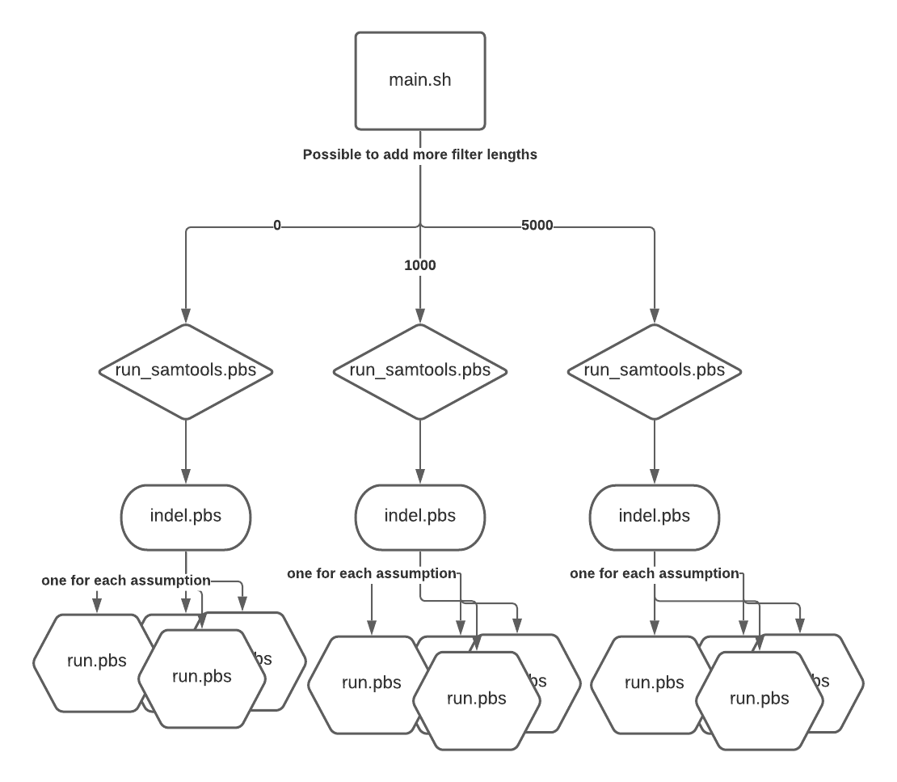

# **TECHNICAL DOCUMENTATION**
 
# Installation
 
```
git clone https://github.com/TeamGenomeSize/GenomeSize
```
 
### Prerequisites
 
- [UNSW Katana - Linux supercomputer](https://unsw-restech.github.io/index.html)
- [Python3](https://www.python.org/downloads/)
- [Samtools](http://www.htslib.org/)
 
# Pipeline Components
 
The genome size pipeline is composed of multiple scripts. Each script contains detailed documentation about its specific function and implementation. Here is a summary of each script's core functionality.
 
### **`main.sh`**
- The task master of the pipeline, coordinates the run_samtools.pbs, indel.pbs, run.pbs and tidy.pbs
- Pipeline can be customised by using flags or changing line with “FILTERS=” to changed filter lengths tested
- Workflow is as follows:
- 

 
### **`genomeSize.py`**
- Uses helper functions to calculate and output genome size for each assumption into the log.csv, reads from .txt as inputs for these calculations
- Write into a file called `genomeSize_log.csv`. Will append more lines to this file if it is not empty
 
### **`assumptions.txt`**
- The list of assumptions to be run. Each set of assumptions will launch its own run.pbs and it’s own calculation
 
### **`run.pbs`**
- Calls the `genomeSize.py` program, and records the time taken by the pipeline
 
### **`code/assumptions.py`**
- Generates the list of reasonable assumptions for the pipeline to test
 
### **`code/getDepth.pbs`**
- Contains all helper functions pertaining to the calculation of the read depth
- Will watch for it’s input file to be populated with a read depth number and read from that instead of multiple processes redoing the same calculation, saves compute and some bit of time

### **`code/indel.pbs`**
- First checks if relevant output text files for insertion/deletion bias and soft clipping have been created
- Runs SAMtools view to parse BAM file to extract CIGAR strings and saves the output to file
- Calls indel_bias.py with CIGAR string file as input to compute insertion-deletion bias and soft clipping value
- Removes intermediary files
 
### **`code/indel_bias.py`**
- Parses file of all cigar strings to count the total matches, insertions, deletions and soft clipping and creates output .txt containing that information. (Hard clipping does not have bearing on genome size calculation but it was included in case of a requirement for extension) 
- Computes insertion/deletion bias as the ratio  (matches + insertions)/(matches + deletions) i.e. read bases/assembly bases and writes value to output text file
- Outputs number of soft clipping bases in data to a text file for further processing in `genomeSize.py`
- The python writes computations to .txt files to reduce time and avoid the need to repeat the calculation

 
### **`code/run_samtools.pbs`**
- First checks if relevant output text files have already been created, will not repeat computation if it already exists
- Loads SAMtools module and records time taken for SAMtools run
- Parses BAM file to get a baseline total read volume for genome using SAMtools stats, selects read volume to be ‘total volume’ as defined in the [official documentation](https://www.htslib.org/doc/samtools-stats.html)
- Generates pileup.out for each inputted BAM file
 
### **`code/tidy.pbs`**
- Calculates total time taken for the pipeline
- Allows the removal of intermediary files, if user chooses to specify
- Changes permissions on output files to allow other users in the same group to access files generated by the pipeline for easy collaboration
 
# Authors
 
#### UNSW BINF6112 Team Genome Size 2020
- **Ailin Zhang**
- [**Alana Huang**](https://www.linkedin.com/in/alana-y-huang/)
- [**Chelsea Liang**](https://www.linkedin.com/in/chelsea-liang-03674b140/)
- **Sebastian Porter Zadro**
- [**Sehhaj Grewal**](https://www.linkedin.com/in/sehhajgrewal/)
 
## License
 
This project is not licensed.
 
## Acknowledgments
 
[Richard Edwards](http://www.slimsuite.unsw.edu.au/)
